# Hachime: Student Career Pathfinder System

Hachime is a comprehensive career guidance and academic tracking platform. It charts student progress through finished and liked subjects, maps academic achievements to industry skills, and dynamically calculates personalized career pathways, salary growth indicators, and curriculum gap analyses.

## 📸 Previews & Screenshots

<details>
<summary><b>🖥️ Admin Web Console (Click to expand)</b></summary>

| Dashboard | Student Management | Alumni Tracking |
| :---: | :---: | :---: |
| 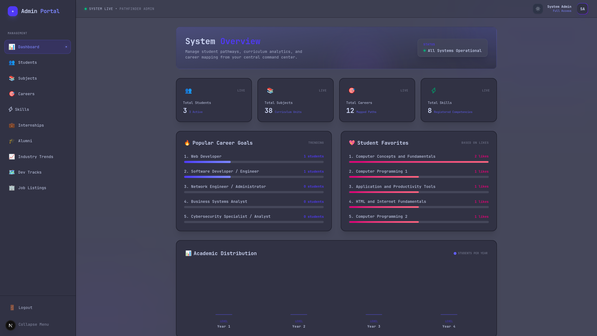 | 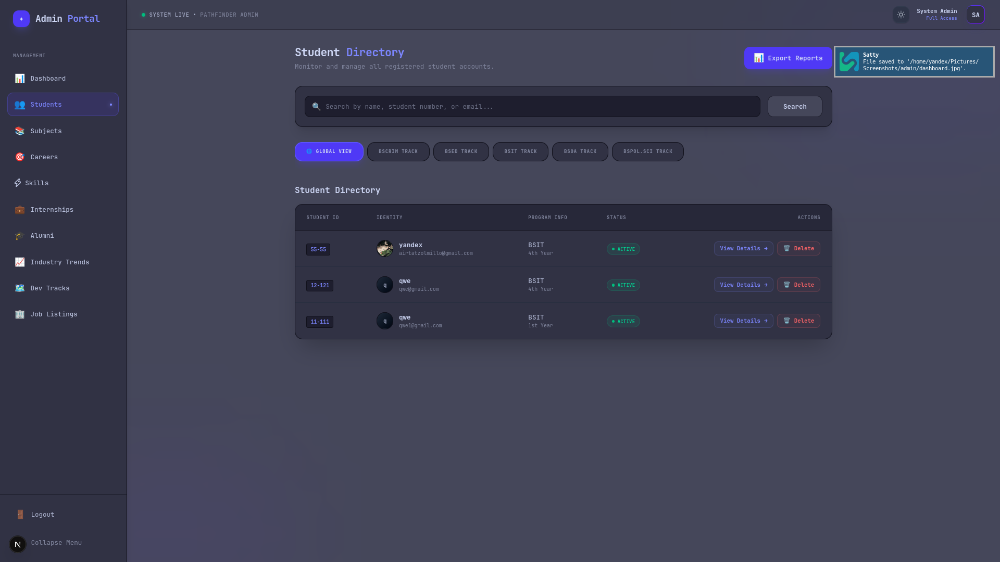 | 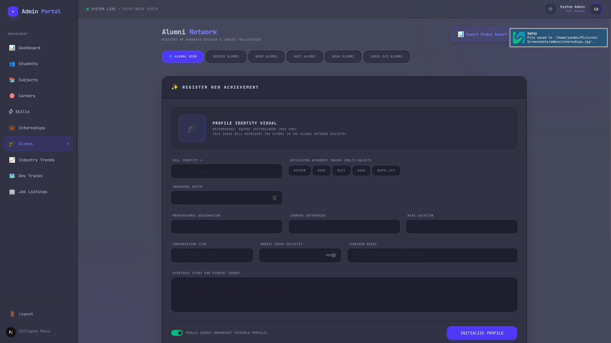 |
| Core stats and analytics overview | Student profile list and details | Management of alumni database |

| Subject Config | Skills Mapping | Dev Tracks Configuration |
| :---: | :---: | :---: |
| 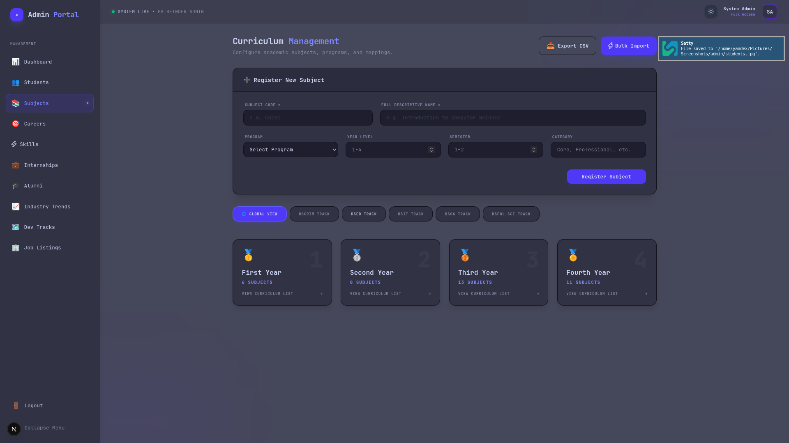 | 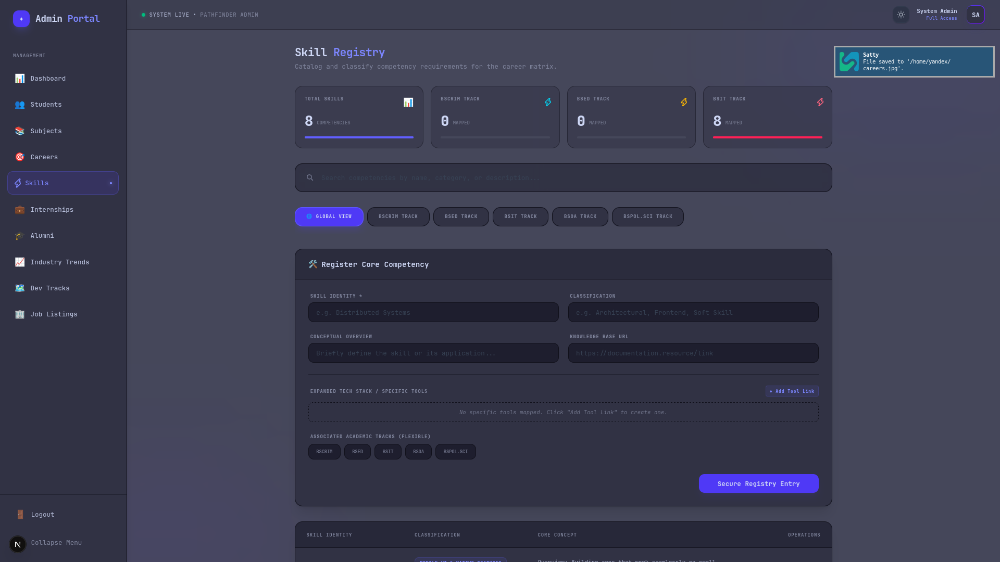 | 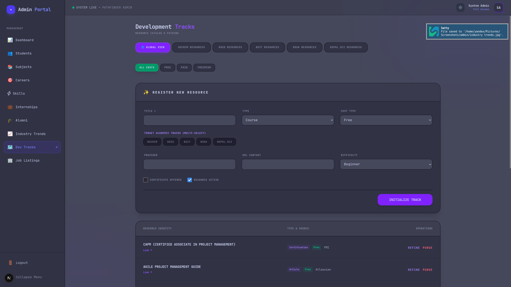 |
| Curriculum subject configurations | Academic skills mapping & gap analysis settings | Career track pathways definitions |

| Industry Trends | Internship Opportunities | Job Listings Config |
| :---: | :---: | :---: |
| 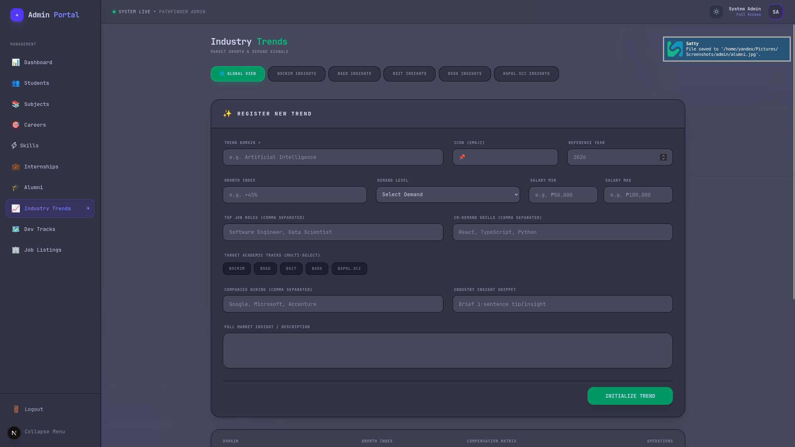 | 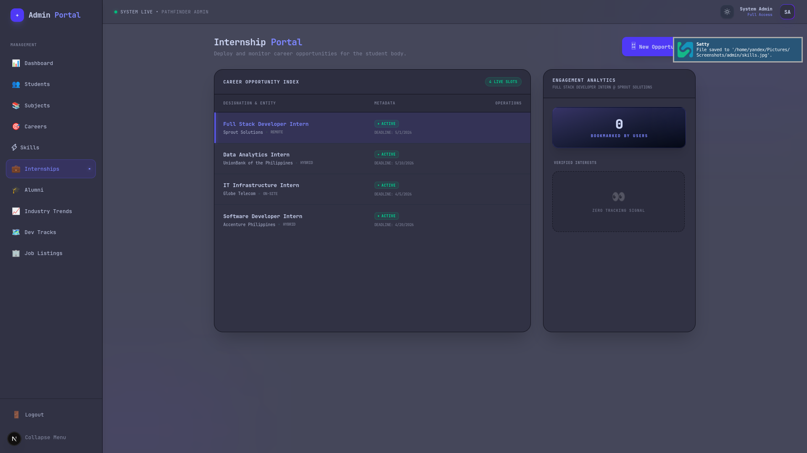 | 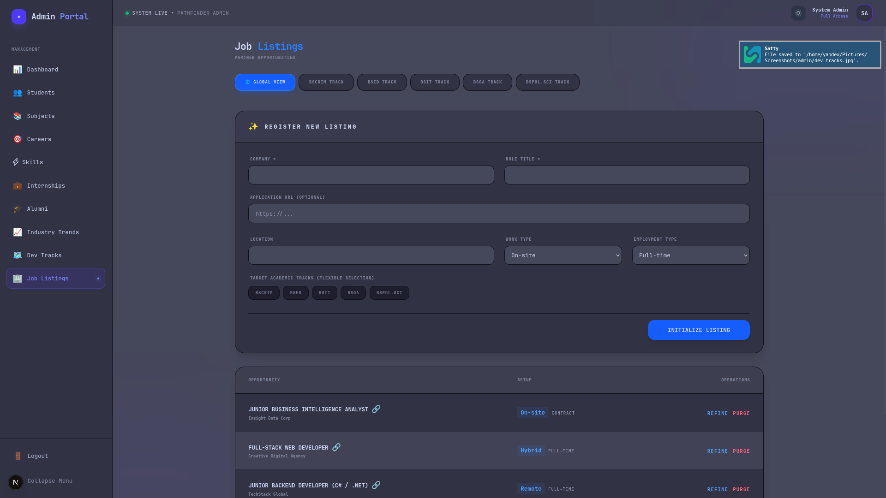 |
| Market salary and job trends analysis config | Career internship posting management | Standardized job profile management |

</details>

<details>
<summary><b>📱 Student Mobile App (Click to expand)</b></summary>

| Login & Welcome | Home Screen | Skills Progress |
| :---: | :---: | :---: |
| 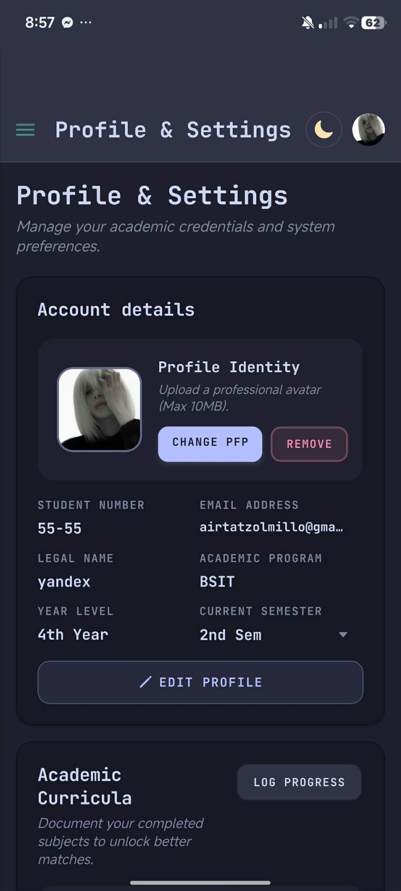 | 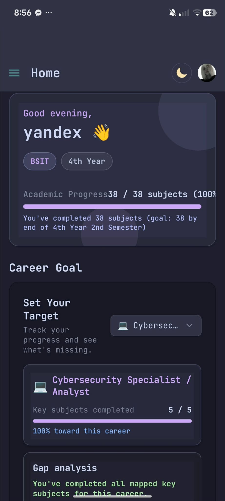 | 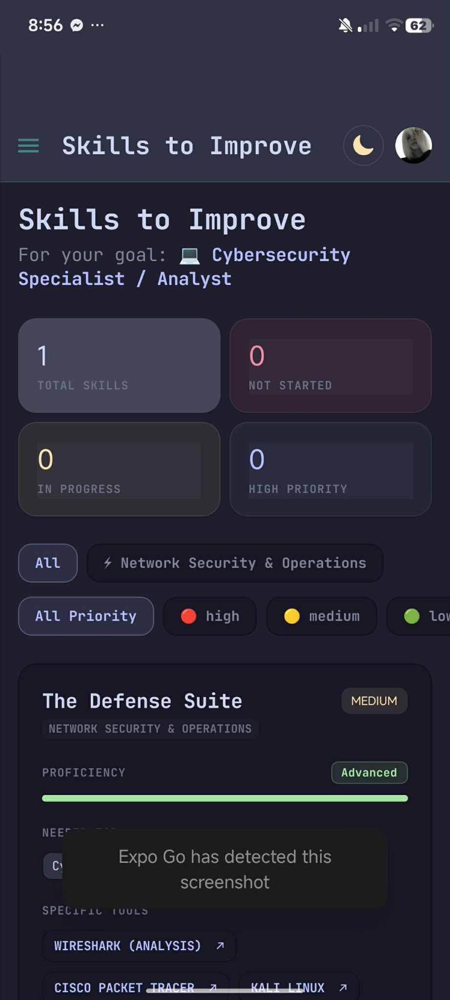 |
| Secure student access | Personalized dashboard and feeds | Academic skill achievement visualization |

| Career Pathway | Dev Tracks | Industry Trends |
| :---: | :---: | :---: |
| 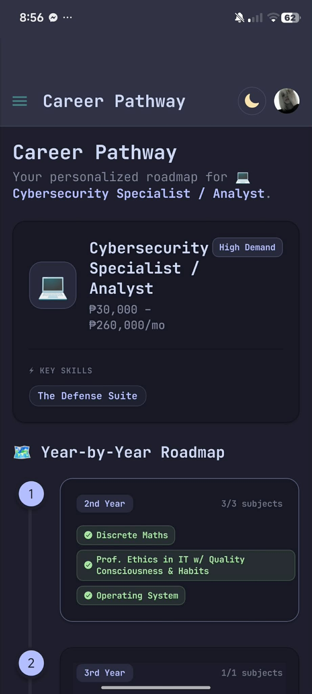 | 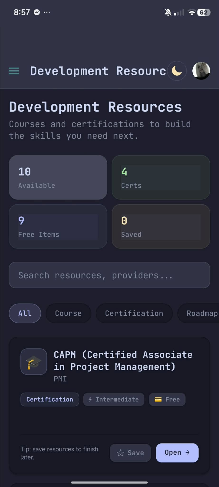 | 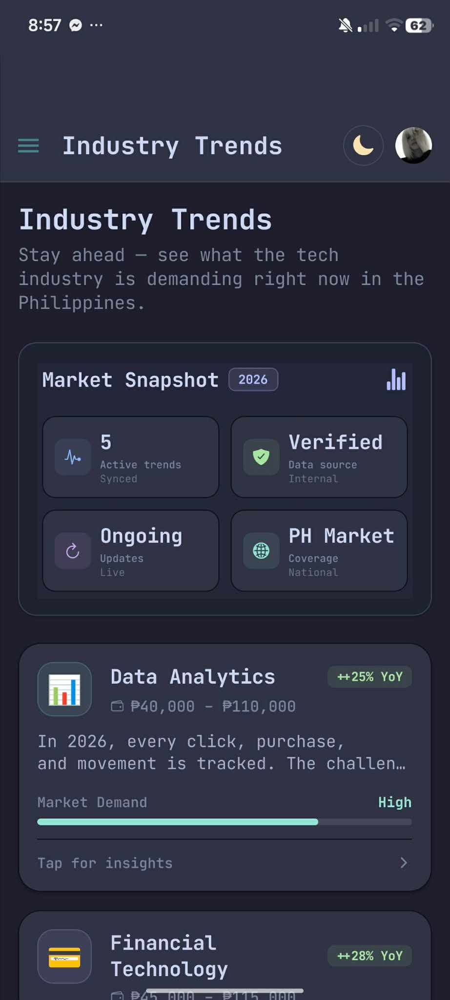 |
| Dynamic career path calculator | Professional specialization roadmaps | Market metrics and trend updates |

| Internships | Alumni Network | Job Listings |
| :---: | :---: | :---: |
| 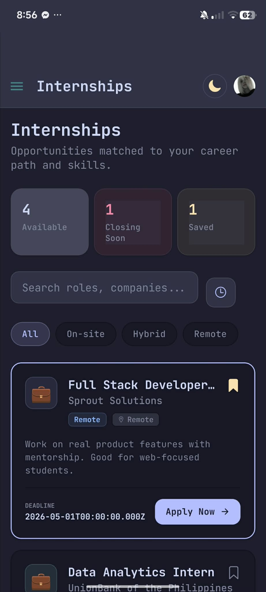 | 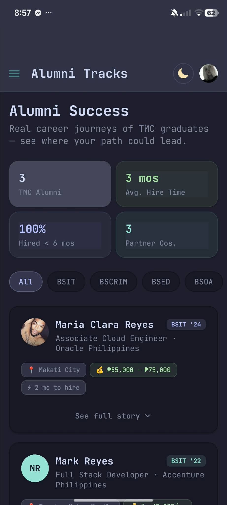 | 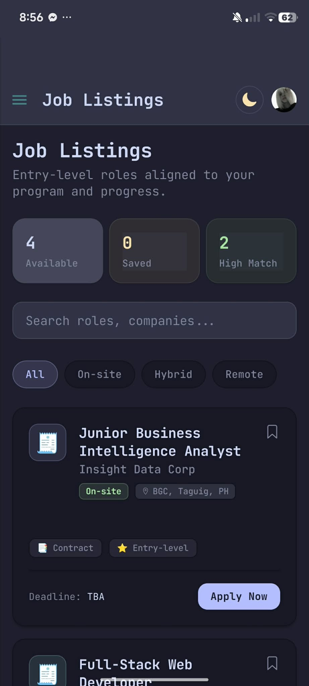 |
| Interactive internship opportunities | Connect with graduate peers | Career search and application board |

</details>

---

## 🏗️ Architecture & Engineering Highlights

This system has been engineered to follow modern production-grade standards, focusing on clean separation of concerns, scalability, and observability.

### 1. Strict Modular MVC Pattern
The backend has been refactored from a flat structure into a **feature-based modular MVC architecture** (Model-View-Controller) utilizing NestJS modules:
* **Models (Entities & Repositories):** Database schemas are structured as TypeORM entities. All database access logic and raw SQL queries are abstracted into custom Repository classes (e.g., `StudentRepository`) ensuring services remain database-agnostic.
* **Views (DTOs):** Data Transfer Objects (DTOs) strictly shape and validate incoming and outgoing REST payloads.
* **Controllers:** The HTTP layer is decoupled from business rules. Controllers act strictly as routes and query-parameter parsers.

### 2. Service Domain Decomposition
To respect the **Single Responsibility Principle (SRP)**, complex "god services" have been broken down into highly focused domain services:
* `StudentProfileService` – Profile CRUD operations, password security, and career goals.
* `StudentSubjectsService` – Academic curriculum progress tracking.
* `StudentSkillsService` – Personalized roadmap calculations and skill gap audits.
* `StudentAdminService` – Administrative controls, activation states, and management.
* *Coordinated using the **Facade Design Pattern** to maintain 100% backwards compatibility.*

### 3. In-Memory Caching (Redis)
High-latency, calculation-heavy dashboard endpoints (such as skills progress and career roadmaps) are protected by a **Redis Caching layer**:
* Cached results are served instantly in-memory, bypassing expensive SQL joins and aggregations.
* **Smart Invalidation:** Modifying student profiles, updating password credentials, or saving new subject milestones automatically flushes and updates the cache.

### 4. Interactive API Documentation (Swagger)
The entire REST API is fully annotated and documented.
* Access the interactive dashboard at: `http://localhost:4000/api/docs`
* Enables developers and recruiters to review routes, inspect schemas, input JWT tokens, and execute live queries directly from the browser.

### 5. Automated CI Pipeline (GitHub Actions)
A Continuous Integration pipeline is configured via GitHub Actions.
* Automatically triggers on every `push` and `pull_request` to the `main` branch.
* Runs strict TypeScript compilation checks and production bundle builds in a clean container to guarantee build stability.

---

## 🛠️ Technology Stack

* **Backend Framework:** NestJS (Node.js, TypeScript)
* **Frontend Framework:** Next.js (React)
* **Database:** MySQL 8.0
* **Caching Server:** Redis (Alpine)
* **DevOps & Containers:** Docker, Docker Compose, GitHub Actions
* **Database ORM:** TypeORM

---

## 🚀 Quick Start (Local Development)

The entire application stack is containerized. You do not need to install Node.js, MySQL, or Redis locally.

### Prerequisites
* [Docker](https://www.docker.com/)
* [Docker Compose](https://docs.docker.com/compose/)

### Running the Application
1. Clone the repository:
   ```bash
   git clone https://github.com/Yandex-ssh/hachime.git
   cd hachime
   ```

2. Build and start the container services in detached mode:
   ```bash
   docker compose up -d
   ```

3. Check the running status of your services:
   ```bash
   docker compose ps
   ```

### Application URLs
* **Frontend Application:** `http://localhost:3000`
* **Backend REST API:** `http://localhost:4000`
* **Swagger API Documentation:** `http://localhost:4000/api/docs`
* **Redis Caching Server:** Running on port `6379`
* **MySQL Database Server:** Exposed locally on port `3307`
